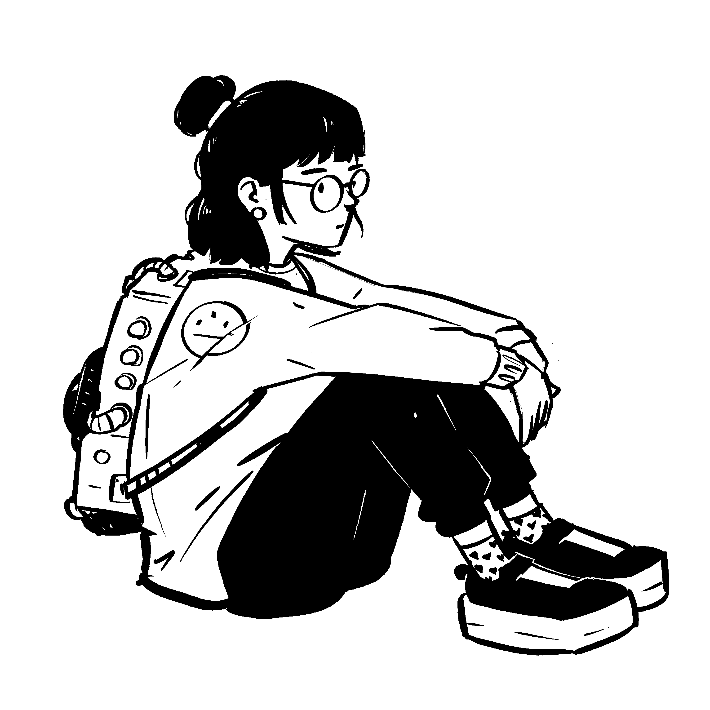

  

# Hey, I'm liminal-cipher. 👋

I’m a grad with a major in **Technological Systems Management** and a minor in **Computer Science**. Right now, I’m focusing on the job search while sharpening my skills and building tools that actually serve a purpose in my day-to-day life.

### 💻 What I’m up to
- **Building:** Mostly mobile apps using **React Native**, **JS**, and **Firebase**. I’m a big fan of "utility" coding—if I have a problem in my life, I try to build an app to fix it.
- **Learning:** Diving deeper into **Python** through some coursework. I'm really enjoying the logic and how satisfying it is to work with.

### 🛠️ Tech Stack

### ☕ About Me
- **Vibe:** I've always been fascinated by **liminal spaces**—that strange, quiet feeling of being "in-between" places.
- **Fuel:** I’m basically powered by **music and coffee**. My personality tends to come in "phases"—I’ll spend months obsessing over a specific artist or drinking nothing but iced americanos, then wake up one day and decide it’s a latte-and-lofi kind of month.

**Current Status**: 🎧 Looping LANY | 🧊 Iced latte in hand.

### 💬 Let's Chat
I'm a bit of an introvert, but I genuinely love connecting with people over shared interests. If you want to talk shop, collab on a project, or just share a playlist you've been looping, feel free to open a **Discussion** or drop an **Issue** in one of my repos. I’m always around GitHub!
